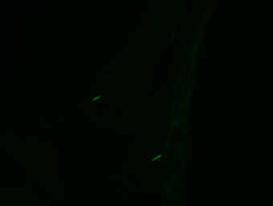
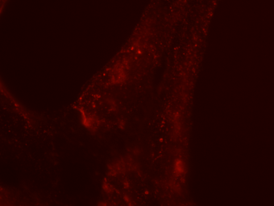

```{r setup, include=FALSE}
knitr::opts_chunk$set(echo = TRUE)
```

# Preface

This is course notes for a crash course on image processing using R, R Markdown, RStudio, and ImageMagick.

It is assumed that the student has been introduced to R but has no background in image processing. The pedagogical plan is that the student first copies existing examples then modifies existing examples, and finally creates new code.

The pedagogical method will be that

1. you first replicate a method from an example,
2. then you modify an existing example,
3. and finally you create a new solution.

Instructions on how to install the package with a demonstration of some of its abilities are found in <https://cran.r-project.org/web/packages/magick/vignettes/intro.html>. More details about the package "magick" can be found in <https://cran.r-project.org/web/packages/magick/magick.pdf>.

A general introduction to image processing is Richard Szeliski, "Computer Vision: Algorithms and Applications", Springer 2010. We will use the free electronic draft, which you can find a link to on <http://szeliski.org/Book/drafts/SzeliskiBook_20100903_draft.pdf>. There is no need to read everything but Section 2.3.2 Color, Section 3.1 Point operator, Section 3.2 Linear filtering, and Section 3.3.2 Morphology are particularly relevant.

# The case
The course uses 2 images: An image showing the location of cilia in green, and an image of the same area showing the amount of the Caveolin CAV1, which is a protein used to regulate the opening and closing of the cell membrane on the cilia.



The images were provided by Lotte B. Pedersen, University of Copenhagen, for details see Pedersen et al., "Endocytic control of cellular signaling at the primary cilium", Trends in biochemical sciences, 2016, <https://doi.org/10.1016/j.tibs.2016.06.002>.

The case used in this exercise is to:

>Quantify the amount of CAV1 in the neigbhourhood of the cilia.

We will use this case to learn basic image processing.

# Reading and displaying images
First we load the Image Magick library. We don't always need to check the configuration, but since it is the first time, we use it, it is good to check.

```{r}
library(magick)
str(magick::magick_config())
```
You can get help on these libraries by, e.g., library(help=magick)

We are now able to read images using the imread() function and see some basic information about the loaded raster image.

```{r}
#setwd("~/Desktop/BigDataInBiotechnology/r")
cilier <- image_read("Image_34362.tif")
print(cilier)
```
We can also plot using the ggplot2 package, which is described in detail at <https://www.rdocumentation.org/packages/ggplot2/>, and there is a cheat sheet at <https://github.com/rstudio/cheatsheets/blob/master/data-visualization-2.1.pdf>

```{r}
library(ggplot2)
image_ggplot(cilier)
```

# Annotating and saving images
We can also annotate the image and save the result.

```{r}
image_draw(cilier) # must use instead of image_ggplot for subsequent rect and text commands
rect(460, 475, 500, 505, border = "red", lty = "dashed", lwd = 5) # xleft, ybottom, xright, ytop
cilierAnno <- image_capture() # read the resulting image
dev.off() # close the device opened by image_draw
image_write(cilierAnno,"test.tiff",format="tiff")
```

The file is saved in a new file called "test.tiff". In RStudio the result is also shown in the Viewer pane.

```{r}
test <- image_read("test.tiff")
image_info(test)
image_ggplot(test)
```

---

## Assignment 1.1
Read the image Image_34363.tif into a variable called protein, check its size, and plot it.

```{r}

```

---

# Color spaces
We saw by image-info() that the cilierIm is in the sRGB colorspace. This is a standard for representing colors defined by Microsoft and HP in 1996, and which you can read more about on <https://en.wikipedia.org/wiki/SRGB>. A list of other color spaces that Image Magick can work with is:
```{r}
colorspace_types()
```

In this document, we will also work with the color spaces RGB, HSV, and Gray. We can make a new image from an old with another color space by image_convert:
```{r}
cilierRBG <-image_convert(cilier, colorspace="RGB")
image_info(cilierRBG)
image_ggplot(cilierRBG)

cilierGray <- image_convert(cilier, colorspace="Gray")
image_info(cilierGray)
image_ggplot(cilierGray)
```

The difference between sRGB and RGB is that sRGB is tuned to the human eye, which is more sensitive to small changes in intensity in the dark area than in the ligth area. The implication is, that sRGB is best for visual inspection of images, but RGB is best for computational purposes. Note that a color image can be converted to gray, but the colors will then be lost, and even though you can convert a gray image to color, the colors will not return.

# Cropping
It is often advantageous to work with smaller parts of the image, since this will allow us to focus on details, and it can make programs run faster, such that we can make experiments without having to wait too long. When we crop, we copy a rectangular section of an existing image, and in Magick the section is specified as the width, height, and lower left corner in coordinates. Notice that this is subtly different from how the box was drawn above. Notice that since image_ggplot has the origin as the upper left, then we the lower left corner is displayed as the upper left.
```{r}
geom <- geometry_area(40,30,460,475)
cilierGrayCrop <- image_crop(cilierGray,geom)
image_ggplot(cilierGrayCrop)
```

---

## Assignment 1.2
Produce a crop of the RGB images of both cilier and protein of the region given above as cilierCrop and proteinCrop. Show them next to each other next to each other. Is there any apparent correlations between the pixels in this area between the two images?

```{r}

```

---

# Images as tables of numbers
The image is a grid of small squares called pixels (picture elements) and each color is represented in various ways. Magick shields you for most of the details, e.g.,

```{r}
image_info(cilier)
```

really means that the image is a 3 dimensional matrix, where the first dimension is the color channel and has 3 different positions (R, G, and B), the second is the width dimension, which has 1360 different positions, and the third is the height, which has 1024 different positions. This is typical for color images. Further, a magick object is really a list of images, but our only contains one image, whos bitmap we can access as:

```{r}
cilierBM <- cilier[[1]] # get the array of raw values of cilierIm
str(cilierBM)
```

The list notation [[]] is an alias of the image_data() function in Magick. A green is a raw format, where each value is an integer in the range (0..255). We can index the image using [] brackets. Indexing starts at 1, i.e., (1,1) is the coordinate of the top left corner, and for cilier, the green value at (480,490) is

```{r}
cilierBM[2,480,490]
```

The value are shown in hexadecimal (0,1,2,...,f,10,11,...1f,...,ff) corresponding to the values (0..255). To convert it to decimal form, we can use as.integer

```{r}
as.integer(cilierBM[2,480,490])
```

We can extract several values using slicing. E.g., the red and blue values at (480,490) are

```{r}
cilierBM[c(1,3),480,490]
```

and all rgb-values are

```{r}
cilierBM[,480,490]
```

Likewise, we can cut out a small rectangular section of all channels as,

```{r}
cilierBMCrop <- cilierBM[,460:500,475:505]
```

To visualize the cropped bitmap as an image, we need to convert it back to a Magick image with image_read:

```{r}
cilierBMCropIm <- image_read(cilierBMCrop) # Convert from raw array to image
image_ggplot(cilierBMCropIm)
```
In most cases, we won't need to work directly with the numbers, but it is useful to keep in mind that all operations on images in the end are operations on these numbers.

---

## Assignment 1.3
Print the RGB value of the center pixel of cilierCrop and proteinCrop. Do the RGB values correspond to what you expect?

```{r}

```

---

# Image histograms
Histograms can be used to get an overview of the values in an image. The histogram function is slow, and in general it is a good idea to work with small images when testing ideas for a program, in order not to wast too much time and to better see details. So in the following, we will work with the region [,460:500,475:505]. Further, histograms is an example, where we must first extract the bitmap. This is all done as follows:

```{r}
geom <- geometry_area(40,30,460,475) # region of interest: (width, height, x_off, y_off)
cilierCrop <- image_crop(cilier,geom) #Overwrites the crop above!
image_ggplot(cilierCrop)
```

To use ggplot2 we first need to convert the values to doubles (which as a sideeffect rearranges the 3-dimensional array into a 1-dimensional array as hist requires):

```{r}
plt <- qplot(as.double(cilierCrop[[1]]),geom="histogram")
plt+labs(title="Histogram of cilierCrop",x="intensity",y="count")
```

This histogram shows the distribution of all the 3 color channels and often it is useful to look at the channels individually. This we can do with slicing,

```{r}
cilierCropR <- image_channel(cilierCrop,channel="red")
cilierCropG <- image_channel(cilierCrop,channel="green")
cilierCropB <- image_channel(cilierCrop,channel="blue")
pltRed<-qplot(as.double(cilierCropR[[1]]),geom="histogram",bins=100)
pltRed<-pltRed+labs(title="Histogram of cilierCropR",x="intensity",y="count")
print(pltRed)
pltGreen<-qplot(as.double(cilierCropG[[1]]),geom="histogram",bins=100)
pltGreen<-pltGreen+labs(title="Histogram of cilierCropG",x="intensity",y="count")
print(pltGreen)
pltBlue<-qplot(as.double(cilierCropB[[1]]),geom="histogram",bins=100)
pltBlue<-pltBlue+labs(title="Histogram of cilierCropB",x="intensity",y="count")
print(pltBlue)
```
As expected, we see that the green channels has the widest spread of values.

We can plot them side-by-side using gridExtra (<https://cran.r-project.org/web/packages/gridExtra/gridExtra.pdf>, <https://cran.r-project.org/web/packages/egg/vignettes/Ecosystem.html>):

```{r}
library(gridExtra)
grid.arrange(pltRed,pltGreen,pltBlue,nrow=1,ncol=3)
```

Often it is enough to know the range of the image channels. This can be achieved with the max() and min() functions. Since we will perform an almost identical action 3 times, we write it up as a for-loop and use paste() to make a human readable text:

```{r}
cilierCropBM <- cilierCrop[[1]]
for (chn in 1:3){
  cilierCropBMMin <- min(as.integer(cilierCropBM[chn,,]))
  cilierCropBMMax <- max(as.integer(cilierCropBM[chn,,]))
  print(paste("Channel ", chn, " : ", cilierCropBMMin, " to ", cilierCropBMMax))
}
```

---

## Assignment 1.4
Calculate the histogram of the 3 channels in proteinCrop and display them side-by-side. Give a qualitative comparison of the histograms of the RGB channels cilierCrop and proteinCrop.

```{r}

```

---

# Color manipulation
Color can be represented and transformed in many ways. Above we have seen how to convert a RGB image into a gray image. If the contrast is low, then its content can better be visualize using histogram equalization:

```{r}
cilierCrop <- image_crop(cilier,geom) # overwrites earlier version!
cilierCropGray <- image_convert(cilierCrop,colorspace = "GRAY")
cilierCropGrayEq <- image_equalize(cilierCropGray)
pltOrig <- image_ggplot(cilierCropGray)
pltOrigHist <- qplot(as.double(cilierCropGray[[1]]),geom="histogram")+labs(title="Histogram of cilierCropGray",x="intensity",y="count")
pltIm<-image_ggplot(cilierCropGrayEq)
pltHist <- qplot(as.double(cilierCropGrayEq[[1]]),geom="histogram")+labs(title="Histogram of cilierCropGrayEq",x="intensity",y="count")
grid.arrange(pltOrig,pltOrigHist,pltIm,pltHist,nrow=2,ncol=2)
```
The resulting image has had intensities redistributed such that the histogram is more uniform. This may be useful for discovering faint structures.

Other colorspaces may be useful, e.g., Hue-Saturation-Value (HSV). In Magick, Value is called Brightness and Lightness, and hence this colorspace is also referred to as HSB and HSL.

```{r}
# Due to an error in Magick, we first have to convert the colorspace, and then we can extract the new channels.
cilierHSL <-image_convert(cilierCrop, colorspace="HSL")
cilierCropH <- image_channel(cilierHSL,channel="Hue")
cilierCropS <- image_channel(cilierHSL,channel="Saturation")
cilierCropL <- image_channel(cilierHSL,channel="Lightness")
pltH<-image_ggplot(cilierCropH)
pltS<-image_ggplot(cilierCropS)
pltL<-image_ggplot(cilierCropL)

pltHue<-qplot(as.double(cilierCropH[[1]]),geom="histogram",bins=100)
pltHue<-pltHue+labs(title="CilierCropH",x="intensity",y="count")
pltSaturation<-qplot(as.double(cilierCropS[[1]]),geom="histogram",bins=100)
pltSaturation<-pltSaturation+labs(title="HCilierCropS",x="intensity",y="count")
pltLightness<-qplot(as.double(cilierCropL[[1]]),geom="histogram",bins=100)
pltLightness<-pltLightness+labs(title="CilierCropL",x="intensity",y="count")

grid.arrange(pltHue,pltSaturation,pltLightness,pltH,pltS,pltL,nrow=2,ncol=3)
```
There are a wide range of colorspaces which Magick supports, the name of which can be found by colorspace_types() and channel_types():

```{r}
colorspace_types()
channel_types()
```

---

## Assignment 1.5
For cilierCrop, compare the the Gray color image and the Lightness channel by 
a. displaying the images
b. evaluate and display their histograms
c. perform histogram equalization and display the result
on a 2x3 grid. Are there emperical similarities between these two versions of cilierCrop?

```{r}

```

---

# Image expressions
The data in images can be manipulated directly by extracting the bitmaps, performing standard R calculations on the arrays, and convert them back into Magick images again. However, there is also the versatile image_fx() function, which allows us to perform direct calculations on the images. There is a langauge defined to specify expressions, see <https://imagemagick.org/script/fx.php#anatomy>, in brief:
- p is a pixel
- i,j are the row and column of a pixel
- u,v are the first and second images in a list
- r,g,b,hue,saturation,lightness are the red, green, blue, hue, saturation, brightness of a pixel
- w,h,z are widht, height, number of channels of the image
- minima,maxima,mean, are minimum, maximum and mean value of the image
- +,-,*,/,abs(), cos(), sin(), ln(), etc. are builtin operators functions
Pixels can be access in absolute and relative sense, i.e., p[-1,-1].b is the blue value of the pixel left and up from current pixel, and p{10,5}.b is the blue pixel a position (10,5). For example, if we want to multiply all channels in cilierCrop with a factor 2 then we do the following:
```{r}
cilierCrop2 <- image_fx(cilierCrop,"2.0*p")
image_ggplot(cilierCrop2)
maxBefore <- max(as.integer(cilierCrop[[1]]))
maxAfter <- max(as.integer(cilierCrop2[[1]]))
print(paste("Max has been increase from ", maxBefore, " to ", maxAfter))
```
Beware, since the original image had a maximum of 130, then twice that value is 260, however, the maximum value which can be store in the image is 255, hence all values above 255 have been truncated to 255, and detail is thus lost. 

The resulting value can also be stored in different channels, e.g., we can take the green channel of cilierCrop and copy it to the red channel follows,
```{r}
cilierCropY <- image_fx(cilierCrop,"p.g",channel='red')
image_ggplot(cilierCropY)
```
The result is yellow, since green and red looks yellow on the screen.

---

## Assignment 1.6
Use image_fx to make a gray image of cilierCrop by calculating the average of the 3 channels (f(u) = (u.r+u.g+u.b)/3.0). Evaluate its histogram and its histogram equalized image. Compare these with cilierCrop converted to "gray" colorspace, its histogram and its histogram equalized image. Display everything on a 2x3 grid. How does f(u) compare to the builtin colorspace="gray" converted image?

```{r}

```

---

We can make local operations by using references to relative positions. Care have to be taken, though, since internally, Magick stores the pixels as positive floating point values. For example, the change in cilierCropGray in the horizontal direction is calculated as, 
```{r}
print(paste("Range of cilierCropGray: [", min(as.double(cilierCropGray[[1]])), ", ", max(as.double(cilierCropGray[[1]])), "]"))

cilierCropGrayDx <- image_fx(cilierCropGray,"(p[1]-p[-1])/2")

print(paste("Range of cilierCropGrayDx: [", min(as.double(cilierCropGrayDx[[1]])), ", ", max(as.double(cilierCropGrayDx[[1]])), "]"))

image_ggplot(cilierCropGrayDx)
```
The trouble with this calculation is that the result includes negative values, which are outside the range of possible values. Since the original range is [0,1], then the maximum possible range of our calculation is [-0.5,0.5], and we can temporarily shift our origin by 0.5 and then as a second step stretch the result by the new minimum and maximum. This is done as follows:
```{r}
cilierCropGrayDxShifted <- image_fx(cilierCropGray,"0.5+(p[1,0]-p[-1,0])/2.0")
cilierCropGrayDxStretched <- image_fx(cilierCropGrayDxShifted,"(u-minima)/(maxima-minima)")
print(paste("Range of cilierCropGrayDxStretched: [", min(as.numeric(cilierCropGrayDxStretched[[1]])), ", ", max(as.numeric(cilierCropGrayDxStretched[[1]])), "]"))
image_ggplot(cilierCropGrayDxStretched)
```
Warning: Image Magick is a bit undecided on types, as the following example demonstrates
```{r}
# Conversion to integer or numeric gives different values
bm <- cilierCropGrayDxStretched[[1]]
dim(bm)
print(paste("Range sometimes depends on conversions: [", max(as.integer(bm)), ", ", max(as.numeric(bm)), "]"))
# However, in combination with slicing then its always an integer
bm <- cilierCropGrayDxStretched[[1]][1,,]
dim(bm)
print(paste("Range sometimes depends on conversions: [", max(as.integer(bm)), ", ", max(as.numeric(bm)), "]"))
```
Hence, checking intermediate values is always a good idea, when bug hunting.

An edgeness filter is the squared sum of the change in the horisontal and vertical direction. To calculate this we calculate the change in the two directions, use the variang of image_fx for sequences, and finally rescales the result:
```{r}
dx <- image_fx(cilierCropGray,"0.5+(p[1,0]-p[-1,0])/2.0")
image_ggplot(dx)
dy <- image_fx(cilierCropGray,"0.5+(p[0,1]-p[0,-1])/2.0")
image_ggplot(dy)
seq <- image_join(dx,dy)
cilierCropGrayGrad <- image_fx_sequence(seq,"(u-0.5)^2+(v-0.5)^2")# correct for shift
cilierCropGrayGradStretched<-image_fx(cilierCropGrayGrad,"(u-minima)/(maxima-minima)")
image_ggplot(cilierCropGrayGradStretched)
```

---

## Assignment 1.7
Using image_fx, make an image cilierCropGrayStretched, where intensities are streched to fill the entire range [0,1] using f(u)=(u-minima)/(maxima-minima). Compare this to a new image cilierCropGrayLn where all intensities have been transformed by the ln-function as f(p) = ln(1+5*p), and finally stretched to fill the entire range. Visualize the stretched, their histograms in a 2x2 grid. What is the qualitative effect of the ln-transformation?

```{r}
image_ggplot(image_fx(cilierCrop,"p.g"))
```

---

## Assignment 1.8
Use image_join and image_fx_sequence to make a new image, which is the average of cilierCrop and protienCrop. Do you see a spatial correlation between the location of the cilier and the protein?

```{r}

```

---